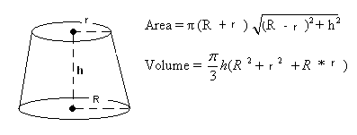
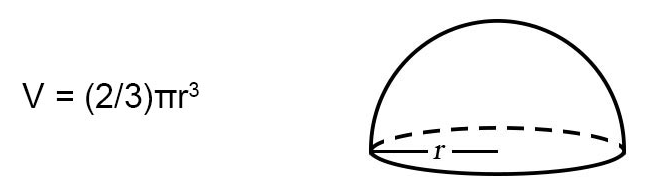
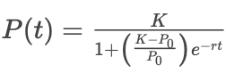

# CSC 104 - Class 1

## A Fancy Calculator

Use the Command Window to compute the simplified value of these expressions. The expected result is provide for you to check against.

- 
    > `320.7937`

- 
    > `-67.3421`

- 
    > `419.3971`

## Script File

Download these files. Fill in the `class_01.m` script in Octave. Run the tests to check.

- [class_01.m](./class-01/class_01.m)
- [class_01_tests.m](./class-01/class_01_tests.m)

### Debugging

- See Exercise 1.10.17. An expression has been typed into the script file for `Fix_1` based on the volume formula for a frustum (see image below), but it was typed incorrectly. Fix it so that the test passes for the values given in the textbook exercise.

    

    

- A wildlife biologist is modeling the growth of a newly introduced deer population in a protected habitat. Because resources such as food and space are limited, the population does not grow exponentially; instead, it follows a logistic growth pattern with carrying capacity _K_, initial population _P_0_, growth rate _r_, and time _t_. The logistic growth formula is:

    

    Suppose the parameter values are:
    - K = 100000
    - P_0 = 100
    - r = 0.2 
    - t = 30 days

    An expression has been typed into the script file for `Fix_2` based on the formula above, but it was typed incorrectly. Fix it so that the test passes for the values given.

### Puzzle

Given any arbitrary number, write an expression that evaluates to the number of digits in the whole number portion that number. Your formula should work for both positive and negative numbers as well as zero. Be able to explain every part of what you come up with.

> Hint: use `log10`.

## Documentation

Explore the Documentation panel.

Search for documentation on the built-in function `fix`.

