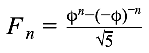
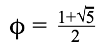

# CSC 104 - Class 3

Write separate function files for each of the following. In a `class_03.m` script, write tests to ensure that the functions work as intended.

### Number of Digits 

(revisited) as a function...
- with tests

### Fibonacci Numbers

You are probably familiar with the Fibonacci sequence: the sequence of numbers (starting with 0, 1) where every number is the sum of the previous 2 numbers. From this definition, you might think in order to calculate the n<sup>th</sup> Fibonacci number, you would have to first calculate all the numbers that came before it. However, this is not the case! The formula for any Fibonacci number is:



which uses the golden ratio value:



To calculate any Fibonacci number, all you have to do is plug 'n' into this equation. This formula is mathematically exact (no rounding would be necessary in theory).
> (Due to MATLAB’s internal rounding of large numbers, you should round your answer to the nearest integer.)

Function Name: `fib`

Inputs:
1. _(double)_ Which Fibonacci number to calculate

Outputs:
1. _(double)_ The specified Fibonacci number

Here are some tests:

```
assert(fib(1), 1);
assert(fib(2), 1);
assert(fib(3), 2);
assert(fib(20), 6765);     % may need to fix this
assert(fib(99), 218922995834555169026);  % only ~15 digit precision
```


### Pizza Party
You decide to host a party and buy some pizzas for you and your friends. But, in order to be fair, every person should get the same number of slices of pizza. Any extra slices will be left
over and saved for later. 

You could try and calculate the pizza slice distribution yourself, but why bother when you can have MATLAB (or Octave!) do all the hard work! Given the number of people at the party and the number of pizzas ordered, write a function that outputs how many slices of pizza each person should should receive, and how many slices of pizza will be left over.

For example, if there are 5 people at the party, and 2 pizzas were ordered, each person would get 3 slices, and 1 slice would be left over, so the first output would be 3 and the second output would be 1.

Function Name: `pizzaParty`

Inputs:
1. _(double)_ Number of party attendees
2. _(double)_ Number of pizzas ordered

Outputs:
1. _(double)_ Slices of pizza per person
2. _(double)_ Slices of pizza left over

For functions with multiple outputs, the standard practice for testing with `assert` is:
- Call the function and capture the multiple return values
- Assert each value separately

```
[s1,s2] = pizzaParty(5, 2);
assert(s1, 3);
assert(s2, 1);

[s1,s2] = pizzaParty(4, 2);
assert(s1, 4);
assert(s2, 0);

[s1,s2] = pizzaParty(12, 2);
assert(s1, 1);
assert(s2, 4);
```


### Temperature Conversion (Optional Arguments)

Write a function with the following behavior:

- If one input is provided (a temperature), the function assumes Celsius → Fahrenheit and returns an unrounded result.
- If two arguments are provided (Tin, direction), it converts according to direction:
    - 'C2F' for Celsius to Fahrenheit
    - 'F2C' for Fahrenheit to Celsius
    - (anything else is an error)

- If three arguments are supplied (Tin, direction, digits), it also rounds the result to the requested number of decimal digits.

```matlab
function Tout = tempConvert(Tin, direction, digits)
%TEMPCONVERT  Convert temperature with optional parameters (overloading via nargin).
%   Tout = TEMPCONVERT(Tin)                % default: Celsius -> Fahrenheit, no rounding
%   Tout = TEMPCONVERT(Tin, direction)     % direction: 'C2F' or 'F2C'
%   Tout = TEMPCONVERT(Tin, direction, digits)  % round to 'digits' decimals
%
%   Examples:
%     tempConvert(25)                % 77            (C -> F)
%     tempConvert(77,'F2C')          % 25            (F -> C)
%     tempConvert(25,'C2F',2)        % 77.00         (rounded to 2 decimals)
%     tempConvert(98.6,'F2C',1)      % 37.0
%
```

Here are some tests for your script file:

```matlab
assert(tempConvert(25), 77, .0001);
assert(tempConvert(77,'F2C'), 25, .0001);
assert(tempConvert(21.37,'c2f', 2), 70.47, .01);
assert(tempConvert(74,'F2C',1), 23.3, .1);
assert(tempConvert(75.5148,'F2C', 4), 24.1749, .0001);
```


## More Exercises

Complete for homework; be ready to present.

### Date Component Extraction

Write a function named `extractDate` that takes a date represented as an 8-digit number (`YYYYMMDD`) and breaks it up into a vector of the three separate components, `[YYYY, MM, DD]`. 

You only have to deal with 8-digit positive integers.

> The `mod()` and `fix()` functions will do all the heavy lifting.

Here are some tests:

```matlab
assert( extractDate( 19480105 ), [ 1948,  1,  5 ] );
assert( extractDate( 20251226 ), [ 2025, 12, 26 ] );
```


### Paper Cup Design

Complete [Exercise 7.14.9](https://learn.zybooks.com/zybook/BERRYCSC104HamidSpring2026/chapter/7/section/14?content_resource_id=89885847) from the textbook. Name your function `paperCup`.

> See [Class 1 exercises](./class-01-basics.md) for the volume of a frustum. You will also need to convert cubic inches to fluid ounces.

Expected behavior (add these as test cases to your `class_03.m` script file):

```
>> [Va, Sa] = paperCup(2, 3.5, 4.25)
Va =
    57.3375
Sa =
    90.4407
>> [Va, Sa] = paperCup(2.5, 3.5, 4.5)
Va =
    71.1551
Sa =
    106.5271
```


### Coaster Set Pricing

You setting up a sale front for custom laser‑engraved wooden coaster sets on Etsy. Buyers can select:

- how many sets they want (`qty`),
- how many engraved characters to include (`numChars`), and
- whether they want rush processing (`rushFlag = 0 or 1`).

Your pricing model is:

- Base price _per set_: `base`
- Personnalization fee: `$0.50` per engraved character (times the number of sets ordered)
- Rush surcharge: `$8.00` per order (not per set)

Your lead-time (production days) rule:

- Normal production: 2 days for the first set, add +1 day per additional two sets. (For example, 3 days for two or three sets ordered; 4 days for 4 or 5 sets ordered.)
- Rush production: Half the amount of normal production (number of days is rounded down).

Implement a function `priceCoasterSet(base, qty, numChars, rushFlag)` returning:

- `price` — total price according to the model above
- `shipDays` — production days per the rules above

Assume `qty` and `numChars` are integers, but round up with `ceil(...)` just in cas.

> **Note:** in general it is a terrible (and dangerous) idea to represent currency values with `double` in MATLAB (or any programming language), but we'll do so for simplicity in this exercise.

Here are some tests. Provide additional ones of your own.

```matlab
[p,s] = priceCoasterSet(5);
assert( p, 5, 0.01 );
assert( s, 2 );

[p,s] = priceCoasterSet(5, 1, 0, true);
assert( p, 13, 0.01 );
assert( s, 1 );

[p,s] = priceCoasterSet(5, 7);
assert( p, 35, 0.01 );
assert( s, 5 );   % 2 + 3

[p,s] = priceCoasterSet(5, 7, 0, 1);
assert( p, 43, 0.01 );
assert( s, 2 );   % (2 + 3) / 2

[p,s] = priceCoasterSet(5, 3, 11);
assert( p, 31.5, 0.01 );
assert( s, 3 );
```


### Fibonacci (Recursive version)

Define a second function that implements the _recursive_ definition of the Fibonacci number sequence. A function that calls itself is called **recursive**. Name your function `fibRec`.

$ F_1=1, \qquad F_2=1, \qquad F_{n+2}=F_{n}+F_{n+1} $

Try it out for small values of _n_ (it will not work for large ones). (The resulting sequence is 1, 1, 2, 3, 5, 8, 13, 21, 34, 55, ... .)

